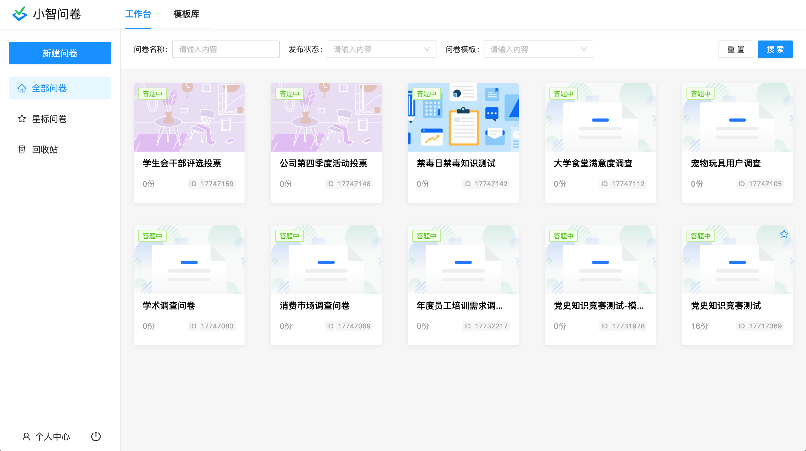
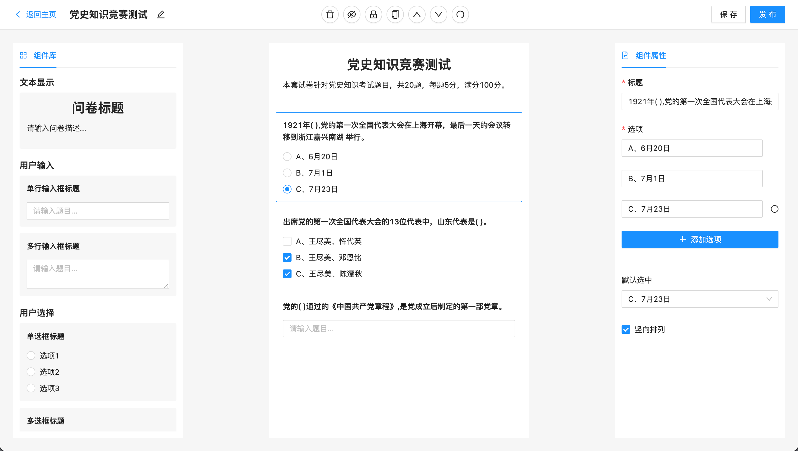
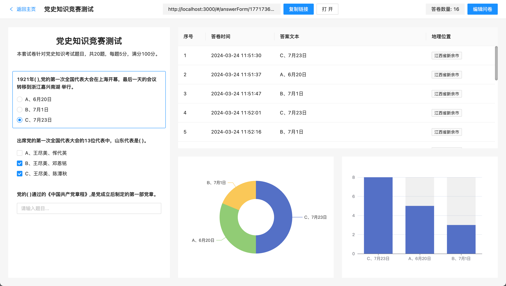
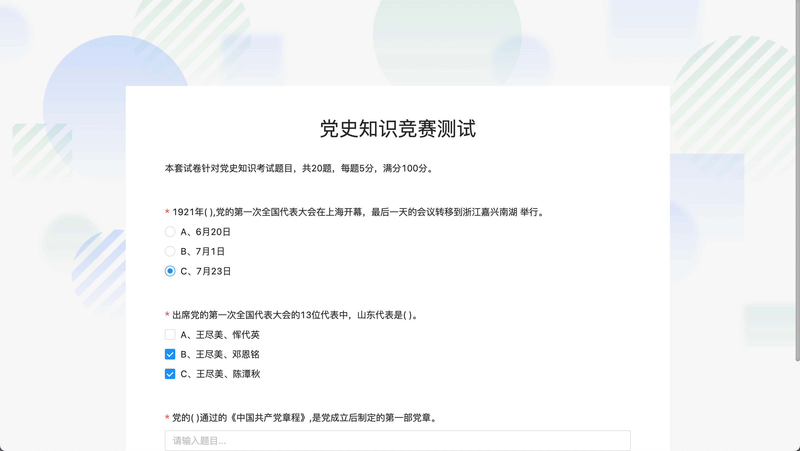

## 一个基于 React + SpringBoot 的在线多功能问卷系统

1. 前端技术栈：React 、React-Router、Webpack、Antd、Zustand、Echarts、DnDKit
2. 后端技术栈：SpringBoot、MySQL、MyBatisPlus、Redis

**主要前端业务需求与技术突破**

- 表单生成器封装：通过简单的配置生成实用性表单，支持自定义表单项和表单配置
- 后端接口联调：包括反向代理、axios 二次封装、接口返回数据规范等
- 路由系统搭建：实现页面缓存、页面切换、元信息赋值、路由组件懒加载等功能
- 拖拽排序功能：实现问卷组件的拖拽排序，以便于用户对问卷内容进行排序和组织
- 问卷系统主业务开发：问卷生成器页面开发、答卷统计页面开发
- 全局弹窗管理：实现了一个全局的弹窗管理机制，可以在任何组件中打开和关闭弹窗

项目笔记：https://github.com/cocoonnu/web-markdown/blob/main/GraduationProject.md

**部分页面静态预览**

